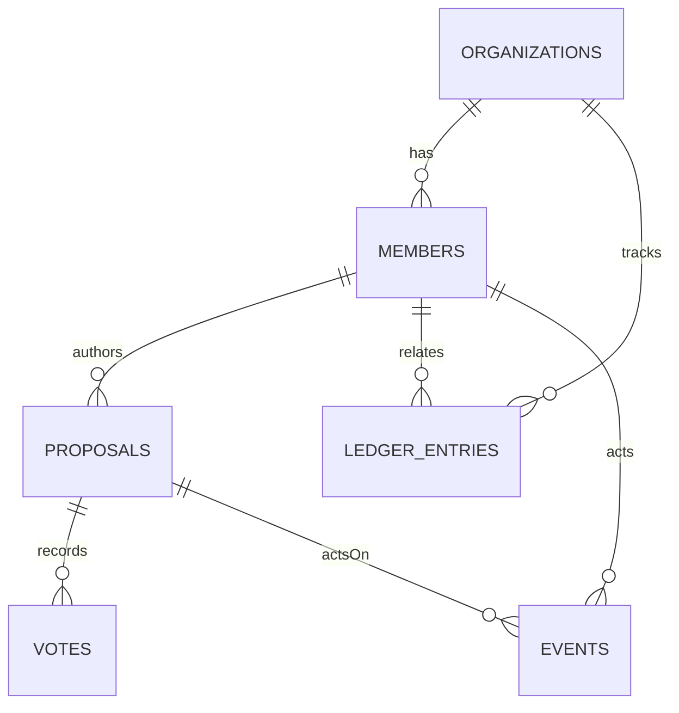

# Data Models (v0.1)

This document defines the current and near-term data model for the Cooperative Digital Toolkit. It is designed for a **modular monolith** with clear domain ownership and future federation in mind.

> Status: **current code implements `proposals`** with Postgres persistence. Other entities are defined here to guide upcoming work.

---

## Conventions

- **IDs**: `SERIAL`/`BIGSERIAL` integer PKs for now (simple dev ergonomics). Consider UUIDs if federation/multi-region demands it.
- **Timestamps**: `TIMESTAMPTZ` in UTC with default `now()`.
- **Soft deletes**: use explicit `status` or `archived_at` rather than hard deletes where audits matter.
- **Names**: snake_case table and column names.
- **Auditability**: mutations should emit an event record (see `events`).
- **Tenancy**: start single-tenant; add `organization_id` columns as domains mature.

---

## ER Overview (near-term)



*Not all edges/columns exist yet; this diagram sets direction.*

---

## Core Tables

### 1) `proposals` (implemented)

Represents a governance item members read and act on.

| Column       | Type        | Null | Default  | Notes                                      |
| ------------ | ----------- | ---- | -------- | ------------------------------------------ |
| `id`         | SERIAL      | NO   |          | Primary key                                |
| `title`      | TEXT        | NO   |          | 1–200 chars recommended                    |
| `body`       | TEXT        | YES  |          | Markdown/plaintext                         |
| `status`     | TEXT        | NO   | `'open'` | Domain: `'open' \| 'closed' \| 'archived'` |
| `created_at` | TIMESTAMPTZ | NO   | `now()`  | UTC                                        |

**Indexes**

* `proposals_pkey` on `id`
* `proposals_created_at_idx` on `(created_at DESC)`
* `proposals_status_idx` on `(status)`

**Recommended constraint (add soon)**

```sql
ALTER TABLE proposals
  ADD CONSTRAINT proposals_status_chk
  CHECK (status IN ('open','closed','archived'));
```

**Queries**

* List newest first:

  ```sql
  SELECT id, title, COALESCE(body,''), status, created_at
  FROM proposals
  ORDER BY id DESC
  LIMIT $1 OFFSET $2;
  ```
* Keyset pagination (preferred later):

  ```sql
  SELECT id, title, COALESCE(body,''), status, created_at
  FROM proposals
  WHERE id < $1
  ORDER BY id DESC
  LIMIT $2;
  ```

---

### 2) `members` (planned)

Represents a person with access to an organization.

| Column            | Type        | Null | Default    | Notes                 |
| ----------------- | ----------- | ---- | ---------- | --------------------- |
| `id`              | SERIAL      | NO   |            | PK                    |
| `organization_id` | INT         | NO   |            | FK → organizations.id |
| `email`           | TEXT        | NO   |            | unique within org     |
| `display_name`    | TEXT        | NO   |            |                       |
| `role`            | TEXT        | NO   | `'member'` | `'member','admin'`    |
| `status`          | TEXT        | NO   | `'active'` | `'active','inactive'` |
| `created_at`      | TIMESTAMPTZ | NO   | `now()`    |                       |

**Indexes**

* `members_org_email_unique` unique `(organization_id, email)`
* `members_role_idx`, `members_status_idx`

---

### 3) `organizations` (planned)

Basic multi-tenant anchor (even if you start with one).

| Column       | Type        | Null | Default | Notes |
| ------------ | ----------- | ---- | ------- | ----- |
| `id`         | SERIAL      | NO   |         | PK    |
| `name`       | TEXT        | NO   |         |       |
| `created_at` | TIMESTAMPTZ | NO   | `now()` |       |

---

### 4) `votes` (planned, phase 2)

Individual member votes on a proposal.

| Column        | Type        | Null | Default | Notes                                 |
| ------------- | ----------- | ---- | ------- | ------------------------------------- |
| `id`          | SERIAL      | NO   |         | PK                                    |
| `proposal_id` | INT         | NO   |         | FK → proposals.id                     |
| `member_id`   | INT         | NO   |         | FK → members.id                       |
| `choice`      | TEXT        | NO   |         | `'yes','no','abstain'` (configurable) |
| `created_at`  | TIMESTAMPTZ | NO   | `now()` |                                       |

**Uniqueness**

* One vote per member per proposal:

  ```sql
  CREATE UNIQUE INDEX votes_unique_member_proposal
  ON votes (proposal_id, member_id);
  ```

---

### 5) `ledger_entries` (planned, MVP-light)

Records simple financial events to export to accounting.

| Column            | Type        | Null | Default | Notes                            |
| ----------------- | ----------- | ---- | ------- | -------------------------------- |
| `id`              | SERIAL      | NO   |         | PK                               |
| `organization_id` | INT         | NO   |         | FK → organizations.id            |
| `member_id`       | INT         | YES  |         | optional link                    |
| `type`            | TEXT        | NO   |         | `'dues','contribution','payout'` |
| `amount_cents`    | INT         | NO   |         | integer cents                    |
| `currency`        | TEXT        | NO   | `'USD'` | ISO 4217                         |
| `note`            | TEXT        | YES  |         |                                  |
| `occurred_at`     | TIMESTAMPTZ | NO   | `now()` | may differ from created_at      |
| `created_at`      | TIMESTAMPTZ | NO   | `now()` |                                  |

---

### 6) `events` (planned)

Append-only audit/event log for critical actions.

| Column            | Type        | Null | Default | Notes                                 |
| ----------------- | ----------- | ---- | ------- | ------------------------------------- |
| `id`              | BIGSERIAL   | NO   |         | PK                                    |
| `actor_member_id` | INT         | YES  |         | FK → members.id (nullable for system) |
| `entity_type`     | TEXT        | NO   |         | e.g., `'proposal'`                    |
| `entity_id`       | INT         | NO   |         | ID in that entity table               |
| `action`          | TEXT        | NO   |         | e.g., `'create','update','close'`     |
| `payload`         | JSONB       | YES  |         | optional snapshot/diff                |
| `created_at`      | TIMESTAMPTZ | NO   | `now()` |                                       |

**Indexing**

* `(entity_type, entity_id, created_at DESC)`
* `(actor_member_id, created_at DESC)`

---

## Domain Rules (initial)

* **Proposal.status**: starts `'open'`; can transition to `'closed'` (immutable after close); `'archived'` hides from default lists.
* **Validation**: `title` required; `body` optional with length caps to prevent bloat.
* **Authorization** (placeholder): Admins create/close; members read (and vote when implemented).

---

## Migrations (approach)

* **Rule:** each domain owns its migrations in `backend/internal/<domain>/migrations/`.
* Use numeric files: `0001_init.sql`, `0002_add_status_check.sql`, etc.
* At startup, a simple migration runner executes pending files in order (idempotent patterns).

**Example — proposals init**

```sql
-- 0001_init.sql
CREATE TABLE IF NOT EXISTS proposals (
  id SERIAL PRIMARY KEY,
  title TEXT NOT NULL,
  body TEXT,
  status TEXT NOT NULL DEFAULT 'open',
  created_at TIMESTAMPTZ NOT NULL DEFAULT now()
);

CREATE INDEX IF NOT EXISTS proposals_created_at_idx ON proposals (created_at DESC);
CREATE INDEX IF NOT EXISTS proposals_status_idx ON proposals (status);
```

**Example — status constraint**

```sql
-- 0002_add_status_check.sql
DO $$
BEGIN
  IF NOT EXISTS (
    SELECT 1 FROM pg_constraint
    WHERE conname = 'proposals_status_chk'
  ) THEN
    ALTER TABLE proposals
      ADD CONSTRAINT proposals_status_chk
      CHECK (status IN ('open','closed','archived'));
  END IF;
END$$;
```

### Runtime runner

This repo embeds SQL files per domain and applies them at startup:

- Runner: `/backend/internal/migrate/migrate.go`
- Proposals: `/backend/internal/proposals/migrations/*.sql` embedded via `//go:embed`
- Server calls `proposals.ApplyMigrations()` on boot

This keeps migrations versioned in the codebase, testable, and domain-owned.

---

## Example Rows

```sql
INSERT INTO proposals (title, body) VALUES
('Adopt shared purchasing policy', 'Bulk buying across co-ops'),
('Approve FY budget draft', 'See attached summary');
```

---

## References

* API: see [`/docs/22-api-spec.md`](./22-api-spec.md)
* Architecture: [`/docs/20-architecture-overview.md`](./20-architecture-overview.md)
* Proposals domain guide: [`/docs/domains/proposals/README.md`](./domains/proposals/README.md)
